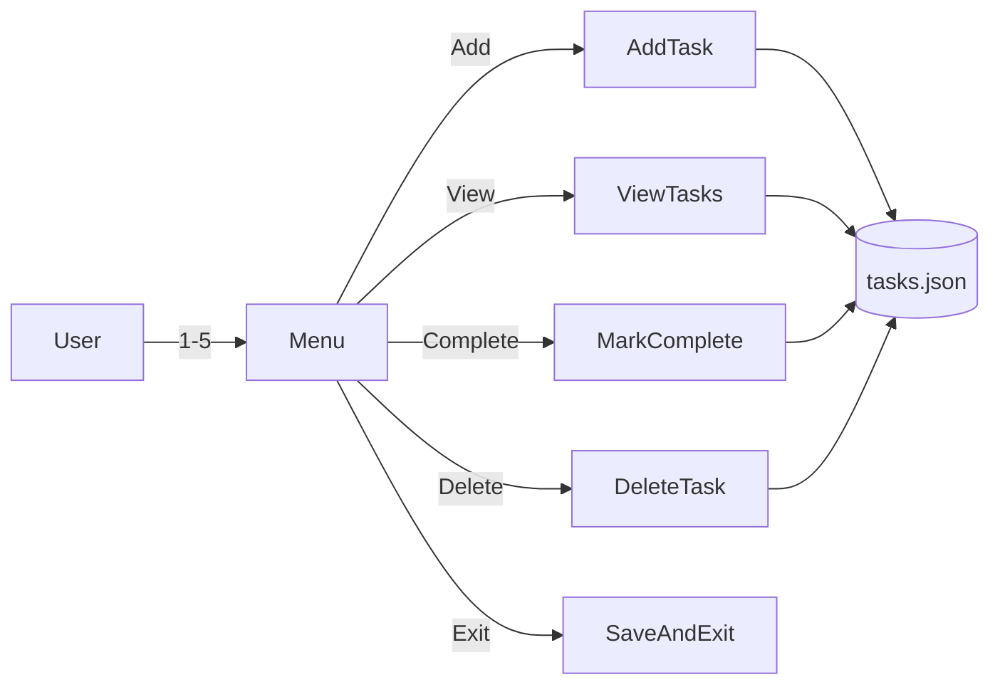

# Technical Documentation

This document describes the architecture, implementation details, and development process for the CLI Task Manager.

## Overview

The CLI Task Manager is a Python command-line application that provides basic task management functionality with JSON-based persistence. It was developed iteratively with a focus on robustness and user experience.

## Architecture



### Design Decisions

- **Single-file architecture**: All logic in `tasks.py` for simplicity and portability
- **Interactive menu**: Chosen over subcommands for ease of use
- **In-memory task list**: Loaded once at startup, saved after each modification
- **List-number selection**: Users select tasks by displayed position (1, 2, 3...) rather than internal ID

## Data Structure

Tasks are stored as a JSON array:

```json
[
  {"id": 1, "title": "Buy groceries", "completed": false},
  {"id": 2, "title": "Walk the dog", "completed": true}
]
```

| Field | Type | Description |
|-------|------|-------------|
| `id` | integer | Unique auto-incrementing identifier (never reused) |
| `title` | string | Task description |
| `completed` | boolean | Completion status |

## Module Structure

### Functions

| Function | Purpose |
|----------|---------|
| `get_tasks_file(file_path)` | Resolve JSON file path (default or `--file` argument) |
| `load_tasks(tasks_file)` | Load and sanitize tasks from JSON; handle missing/corrupt files |
| `save_tasks(tasks, tasks_file)` | Atomic write to JSON (via `.tmp` + rename) |
| `get_next_id(tasks)` | Return `max(id) + 1` for new tasks |
| `add_task(tasks, tasks_file)` | Prompt for title, validate, append, save |
| `view_tasks(tasks)` | Display tasks with checkboxes and completion summary |
| `mark_complete(tasks, tasks_file)` | Select task by number, mark done, save |
| `delete_task(tasks, tasks_file)` | Select task by number, confirm, remove, save |
| `main()` | Parse args, load tasks, run menu loop |

## Robustness Features

### Atomic Saves

To prevent data corruption if the program is interrupted mid-write:

```python
tmp_file = Path(str(tasks_file) + ".tmp")
with open(tmp_file, "w", encoding="utf-8") as f:
    json.dump(tasks, f, indent=2, ensure_ascii=False)
tmp_file.replace(tasks_file)  # Atomic on POSIX
```

### JSON Sanitization

Malformed entries in the JSON file are silently skipped rather than crashing:

```python
for item in raw:
    if not isinstance(item, dict):
        continue
    if "id" not in item or "title" not in item or "completed" not in item:
        continue
    # ... normalize and append valid tasks
```

### Input Validation

- Empty task titles are rejected with a re-prompt
- Invalid menu choices show an error and re-prompt
- Invalid task numbers show the valid range
- All selection prompts support `q` to cancel

## Edge Cases

| Scenario | Behavior |
|----------|----------|
| JSON file missing | Start with empty task list |
| JSON file empty or invalid | Show warning, start with empty list |
| Empty task title entered | Reject, prompt again |
| Invalid menu choice | Show error, prompt again |
| Invalid task number | Show error with valid range, prompt again |
| Delete confirmation | Prompt `Delete "Task title"? (y/N)` before removing |
| Program interrupted mid-save | Atomic write prevents corruption |
| Malformed task entries in JSON | Silently skipped during load |

## Development History

### Initial Plan

1. Create interactive menu with 4 options (add, view, complete, exit)
2. Store tasks in JSON with simple structure (title + completed)
3. Use list numbers for task selection

### Iterative Improvements

1. **Added delete functionality** - 5th menu option with confirmation prompt
2. **Added robustness features**:
   - Atomic saves (write to `.tmp`, then rename)
   - JSON sanitization (skip malformed entries)
   - Dynamic warning messages (show actual file path, not hardcoded)
3. **Added CLI argument** - `--file PATH` for custom storage location
4. **Added input validation** - Empty title rejection, cancel with `q`
5. **Added summary display** - "Tasks (X of Y completed)" header

### Code Review Fixes

- Removed unused `os` import
- Added UTF-8 encoding for file I/O
- Made ID generation defensive against malformed data
- Fixed README to match actual behavior (removed incorrect Ctrl+C claim)

## Dependencies

None. Uses only Python standard library:

- `json` - JSON serialization
- `sys` - Exit handling
- `argparse` - CLI argument parsing
- `pathlib` - File path handling

## Testing

Manual testing covers:

1. Add multiple tasks
2. View tasks (empty list, with tasks)
3. Mark tasks complete
4. Delete with confirmation (y) and cancellation (N)
5. Invalid inputs (empty title, bad numbers, wrong menu choices)
6. Custom `--file` path
7. Corrupt JSON recovery

## Future Improvements

Potential enhancements not implemented:

- **Toggle complete** - Allow marking tasks incomplete again
- **Ctrl+C handling** - Graceful exit instead of traceback
- **Due dates** - Add optional deadline field
- **Priority levels** - Add priority sorting
- **Search/filter** - Find tasks by keyword
- **Undo** - Reverse last action
